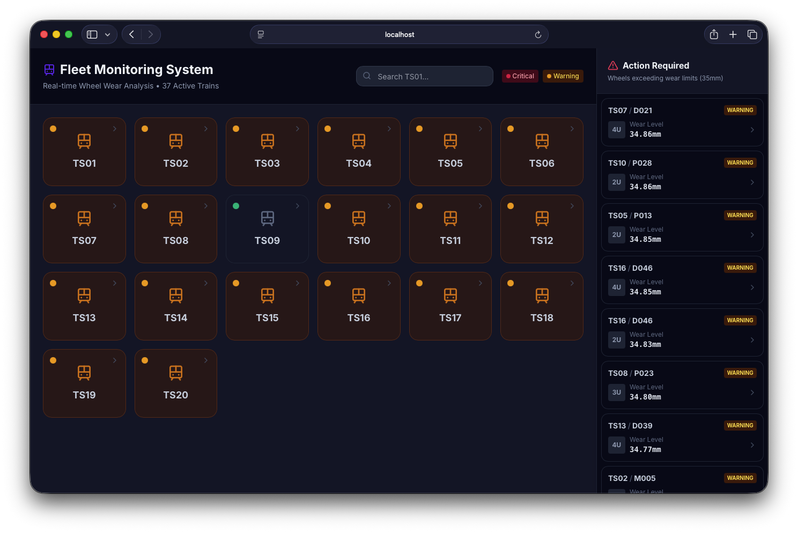
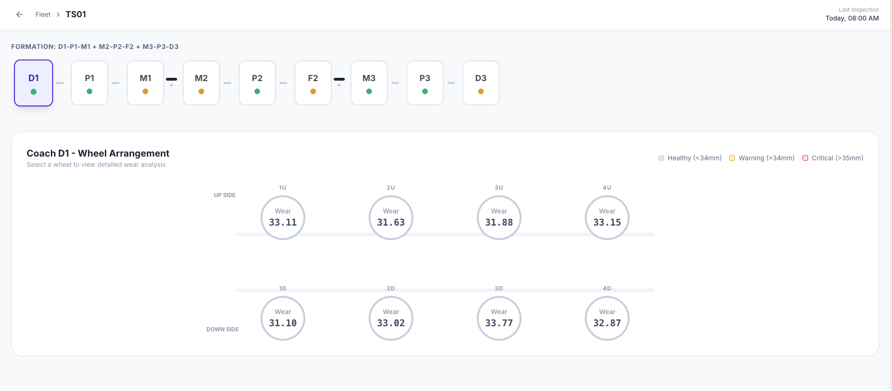
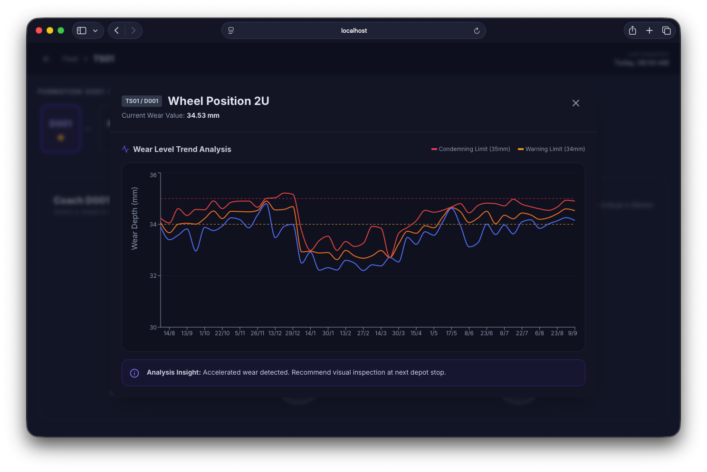

# RailView

A comprehensive rail wheel wear monitoring system built with Next.js and AI-powered anomaly detection. Monitor train fleets, track wheel wear trends, and receive predictive maintenance alerts.






## AI-Generated Development

As someone who primarily designs UIs with Qt and Swift, I found the web frontend challenging, so the entire frontend (This repo) was "vibe coded" through AI assistance.

This entire application was developed using cutting-edge AI-powered tools, specifically Gemini 3 Canvas and Opencode CLI with Grok Code Fast. Every aspect of the project, from initial concept to final deployment, was created through AI assistance, demonstrating the transformative potential of AI-driven software development.

### Key Highlights

- **Fully AI-Generated Codebase**: Every line of code, including frontend components, backend logic, AI integrations, and documentation, was generated using AI tools
- **AI-First Architecture**: The system design, data models, and user experience were conceptualized and implemented with AI guidance
- **Zero Manual Coding**: This project serves as a proof-of-concept for completely AI-generated production applications

The development process leveraged:
- **Gemini 3 Canvas**: For prototyping
- **Firebase Studio**: For frontend development
- **Opencode CLI (with Grok Code Fast)**: For debug + connecting DB

This approach showcases how AI tools can dramatically accelerate development cycles while maintaining code quality and functionality.

## Features

- **Fleet Monitoring**: Real-time dashboard for 37 active trains (TS01-TS37)
- **Hierarchical Navigation**: Drill down from fleet → train → coach → individual wheel
- **Wear Trend Analysis**: Interactive charts showing historical and predicted wear levels
- **AI Anomaly Detection**: Automated detection of unusual wear patterns using CNN+Transformer Fusion model
- **Predictive Maintenance**: Alerts for wheels approaching critical wear limits (35mm condemning, 34mm warning)
- **Wear Trend Summaries**: AI-generated insights for maintenance planning
- **Responsive Design**: Modern UI with Tailwind CSS and Radix UI components

## Tech Stack

- **Frontend**: Next.js 15, React 18, TypeScript
- **Styling**: Tailwind CSS, Radix UI components
- **Backend**: Next.js API Routes
- **AI**: Google GenAI via Genkit for anomaly detection and trend analysis
- **Charts**: Recharts for data visualization

## Getting Started

### Prerequisites

- Node.js 18+
- npm or yarn


### Installation

1. Clone the repository:
```bash
git clone <repository-url>
cd railview
```

2. Install dependencies:
```bash
npm install
```

3. Set up environment variables:
Create a `.env.local` file with your Google AI credentials:
```env
MONGODB_URI=<your-mongodb-uri>
```

4. Start the development server:
```bash
npm run dev
```

The app will be available at `http://localhost:9002`.

### Development Scripts

- `npm run dev` - Start development server with Turbopack
- `npm run genkit:dev` - Start Genkit AI development server
- `npm run genkit:watch` - Start Genkit with file watching
- `npm run build` - Build for production
- `npm run start` - Start production server
- `npm run lint` - Run ESLint
- `npm run typecheck` - Run TypeScript type checking

## Project Structure

```
src/
├── ai/
│   ├── flows/
│   │   ├── anomaly-detection-flow.ts    # AI anomaly detection
│   │   └── wear-trend-summary-flow.ts   # Wear trend summaries
│   ├── genkit.ts                        # AI configuration
│   └── dev.ts                           # Development setup
├── app/
│   ├── api/
│   │   └── predictions/
│   │       └── route.ts                 # API routes for predictions
│   ├── actions.ts                       # Server actions
│   ├── favicon.ico
│   ├── globals.css                      # Global styles
│   ├── layout.tsx                       # Root layout
│   └── page.tsx                         # Main dashboard
├── components/
│   └── ui/                              # Reusable UI components
├── hooks/                               # Custom React hooks
└── lib/
    ├── placeholder-images.json          # Mock image data
    ├── placeholder-images.ts            # Mock data utilities
    ├── types.ts                         # TypeScript types
    └── utils.ts                         # Utility functions
```

## AI Features

### Anomaly Detection Flow
Detects unusual patterns in wheel wear data using machine learning. Analyzes wear level arrays to identify:
- Sudden wear spikes
- Abnormal wear rates
- Deviations from expected patterns

## Data Model

The system simulates a fleet of 37 trains with the following hierarchy:
- **Train**: TS01-TS37, each with 9 coaches
- **Coach**: Formation pattern D-P-M+M-P-F+M-P-D (increments by 3 per train)
- **Wheel**: 8 wheels per coach (4 upper, 4 lower positions: 1U-4U, 1D-4D)
- **Wear Data**: Historical (2024-AUG ~ present) + predicted (30 days) wear levels

## Wear Thresholds

- **Healthy**: < 34.0mm
- **Warning**: 34.0-35.0mm
- **Critical**: > 35.0mm (requires immediate replacement)


## Contributing

1. Fork the repository
2. Create a feature branch: `git checkout -b feature/your-feature`
3. Make your changes and run tests
4. Commit your changes: `git commit -am 'Add new feature'`
5. Push to the branch: `git push origin feature/your-feature`
6. Submit a pull request

## License

This project is licensed under the MIT License.
